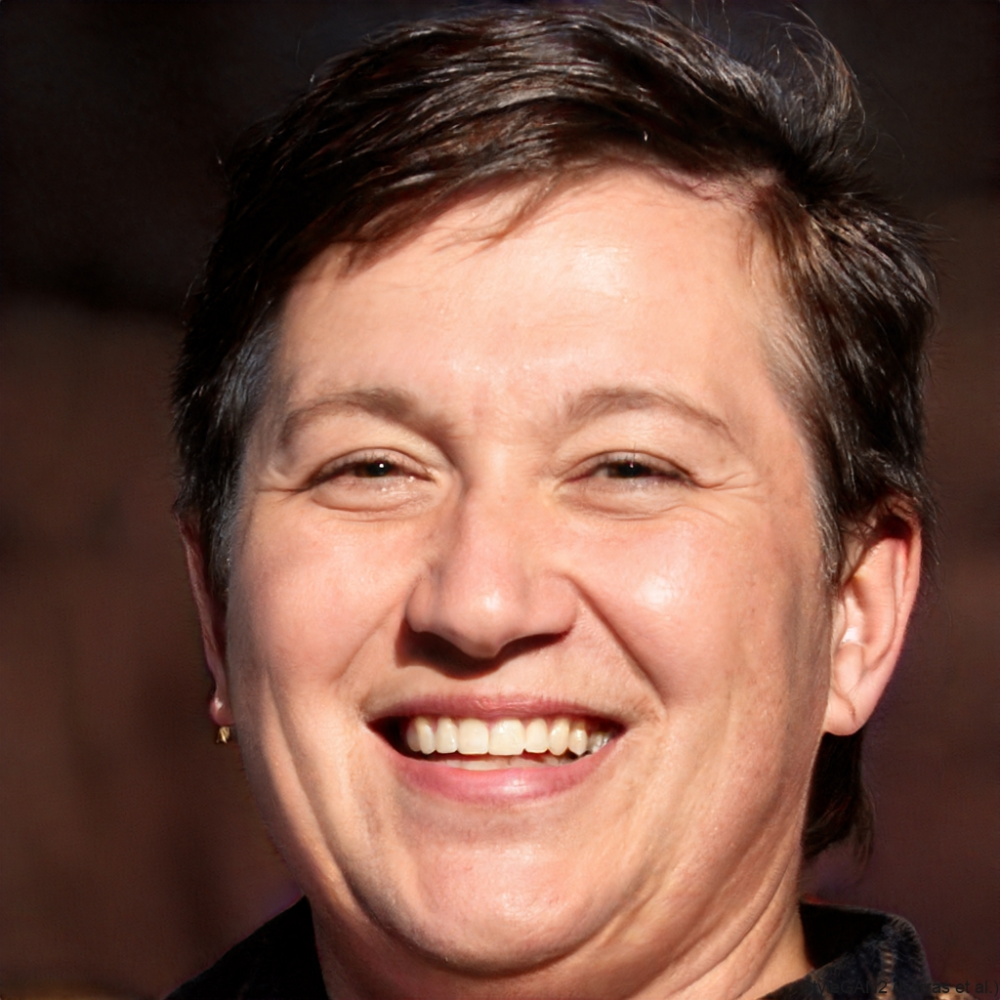

# Especificações do Projeto
A presente seção tem como objetivo detalhar a definição do problema e a proposta de solução a partir da perspectiva do usuário. Para isso, foram utilizados métodos de levantamento de requisitos centrados no usuário, que permitem compreender suas necessidades e transformar essas demandas em funcionalidades claras para o sistema.

Primeiramente, elaborou-se o diagrama de personas, representando de forma simplificada os principais perfis de usuários do sistema, tais como estudantes de Medicina, médicos recém-formados e residentes. Em seguida, foram descritas as histórias de usuários, utilizando a técnica User Story no formato “Eu como [perfil] desejo [funcionalidade] para [benefício]”. Esse recurso possibilitou traduzir expectativas em cenários reais de uso, garantindo maior alinhamento entre a solução proposta e a rotina dos usuários.

Posteriormente, foram definidos os requisitos funcionais e não funcionais, responsáveis por estabelecer tanto as funcionalidades que o sistema deve oferecer quanto as características de qualidade que devem ser atendidas. Para essa etapa, foi empregada a técnica de levantamento e classificação de requisitos, atribuindo-se prioridades que orientam o desenvolvimento.

Por fim, foram consideradas as restrições do projeto, que delimitam o escopo e orientam as decisões técnicas. Entre elas, destacam-se o prazo de entrega restrito ao final do semestre, a impossibilidade de desenvolvimento de um módulo de backend, a ausência de integração com calendários externos, a não implementação de mecanismos avançados de segurança e a utilização exclusiva de ferramentas gratuitas ou de código aberto devido à inexistência de recursos financeiros. Essas limitações garantem a viabilidade da solução dentro do contexto acadêmico em que está inserida.
## Personas
|  | *Rafaela Mattos  Idade:* 19 anos *Profissão:* Estudante de Medicina  *Localização:* Brasil *Objetivo:* Organizar seus estudos e gerenciar melhor o tempo |
|--------------------------------------------|------------------------------------------------------------------------------------------------------------------------------------------------------------------------------------------|

| *Descrição* | *Dores* | *Expectativas* |
|---------------|-----------|------------------|
| Rafaela é uma estudante de medicina que se sente desanimada e perdida com a quantidade de matérias e tarefas. Ela gostaria de se organizar melhor nos estudos, mas sente dificuldade por não ter uma visão clara do que precisa fazer. | - Não sabe como organizar todos os estudos e tarefas - Considera a gestão do tempo complicada e cansativa - Acha difícil encontrar um método claro e eficiente de estudo - Sente ansiedade por perder prazos ou conteúdos importantes | - Conseguir organizar melhor todos os estudos e tarefas - Ter um método claro e fácil de acompanhar para estudar - Encontrar uma forma prática de gerenciar o tempo e atividades |

|  | *Pietra Silva  Idade:* 25 anos *Profissão:* Médica recém-formada *Localização:* Brasil *Objetivo:* Organizar agenda |
|--------------------------------------------|------------------------------------------------------------------------------------------------------------------------------------------------------------------------------------------|

| *Descrição* | *Dores* | *Expectativas* |
|---------------|-----------|------------------|
| Pietra é uma médica recém-formada que precisa organizar plantões e compromissos. Ela quer gerenciar melhor sua agenda, mas sente dificuldade em controlar horários e tarefas. | - Não consegue organizar plantões e compromissos - Acha difícil visualizar toda a rotina de forma clara - Considera a gestão da agenda complicada e cansativa - Dificuldade em priorizar compromissos importantes | - Conseguir organizar plantões e compromissos de forma prática - Ter uma visão clara de toda a rotina diária e semanal - Reduzir a sobrecarga e tornar a gestão da agenda mais eficiente|

|  | *Ana Clara  Idade:* 35 anos *Profissão:* Residente de Medicina *Localização:* Brasil *Objetivo:* Acesso rápido a protocolos clínicos e guias de conduta |
|--------------------------------------------|------------------------------------------------------------------------------------------------------------------------------------------------------------------------------------------|

| *Descrição* | *Dores* | *Expectativas* |
|---------------|-----------|------------------|
| Ana é uma residente de medicina que precisa consultar protocolos de emergência rapidamente durante plantões. Ele quer se sentir seguro ao tomar decisões críticas, mas sente dificuldade em acessar informações de forma prática. | - Não consegue acessar protocolos de emergência de forma rápida - Acha difícil ter todas as informações organizadas e acessíveis - Tem medo de cometer erros por falta de referência clara - Sente insegurança na hora de tomar decisões críticas | - Conseguir consultar protocolos de forma ágil e prática - Ter todas as informações organizadas em um só lugar - eduzir o risco de erros durante atendimentos emergenciais |
## Histórias de Usuários

Com base na análise das personas forma identificadas as seguintes histórias de usuários:

|EU COMO... `PERSONA`| QUERO/PRECISO ... `FUNCIONALIDADE` |PARA ... `MOTIVO/VALOR`                 |
|--------------------|------------------------------------|----------------------------------------|
|Rafaella mattos(Estudante de Medicina)|Organizar meus cronogramas de provas e trabalhos.|Não perder prazo de entrega          |
|Rafaella mattos(Estudante de Medicina)|Um jeito rápido e prático de estudar para minhas provas.|Conseguir revizar matéria de forma rapida |
|Pietra Silva(recém-formada)|Formas de apoio para situações de emergência|agilizar meus processos|
|Pietra Silva(recém-formada)|Organizar minha agenda|Não me esquer dos plantões e consultas|
|Ana Clara(Residente de Medicina)|Acompanhar meu aprendizado e registrá-lo.|Acompanhar minha evolução, e melhorar nos pontos negativos.|
|Ana Clara(Residente de Medicina)|Consultar protocolos de emergência de forma rápida|Quero sentir seguro na hora de tomar as decisões.|

## Requisitos

As tabelas que se seguem apresentam os requisitos funcionais e não funcionais que detalham o escopo do projeto.

### Requisitos Funcionais

|ID    | Descrição do Requisito  | Prioridade | 
|------|-----------------------------------------|----| 
|RF-001|Permitir que o residente consulte protocolos de emergência de forma rápida. | ALTA |  
|RF-002|Registrar e acompanhar o progresso de aprendizado do residente.| MÉDIA | 
|RF-003|Organização do cronograma de provas e trabalho.| ALTA |
|RF-004|Disponibilizar recursos de revisão para provas, incluindo quizzes interativos.| MÉDIA |
|RF-005|O sistema deve oferecer interface prática e intuitiva.| ALTA |
|RF-006|O sistema deve ser rápido e confiável em situações de emergência.| MÉDIA |
|RF-007|Ter formas de acompanhar os resultados é o nível de aprendizado.| ALTA |
|RF-008|Incluir um calendário para marcação dos prazos.| ALTA |
|RF-009|Classificação de atividades por cores ou categorias (plantões, aulas, provas, compromissos pessoais).| ALTA |
|RF-010|Área de anotações rápidas para registro de informações durante plantões ou estudos.| ALTA |

### Requisitos não Funcionais

|ID     | Descrição do Requisito  |Prioridade |
|-------|-------------------------|----|
|RNF-001|O sistema deve carregar as telas em até 4 segundos em condições normais de uso. | MÉDIA | 
|RNF-002|O sistema deve suportar pelo menos 100 usuários simultâneos sem degradação significativa de desempenho. | ALTA | 
|RNF-003|O sistema deve ser compatível com navegadores modernos (Google Chrome, Mozilla Firefox, Microsoft Edge).| ALTA |
|RNF-004|O sistema deve ser totalmente responsivo.| ALTA |
|RNF-005|Deve funcionar em dispositivos móveis e desktops.| BAIXA |
|RNF-006|O acesso ao sistema deve ser protegido por autenticação de usuário.| ALTA |
## Restrições

O projeto está restrito pelos itens apresentados na tabela a seguir.

|ID| Restrição                                             |
|--|-------------------------------------------------------|
|01| O projeto deverá ser entregue até o final do semestre |
|02| Não pode ser desenvolvido um módulo de backend        |
|03| O sistema não fará integração com outros calendários ou aplicativos de terceiros|
|04| A aplicação não contará com recursos de segurança avançados|
|05| Não haverá recursos financeiros destinados à aquisição de softwares pagos|
